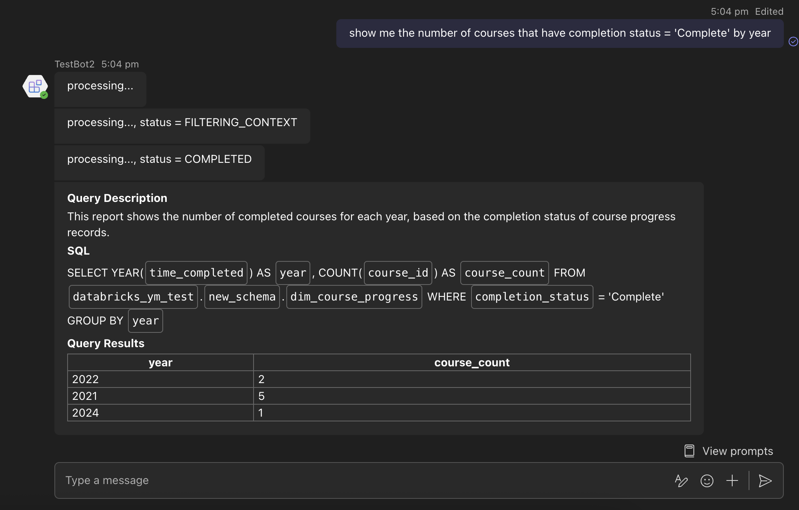

# DataBricks Bot for Microsoft Teams

This is a Microsoft Teams Bot to use natural language to query DataBricks.

## Get started

> **Prerequisites**
>
> To run in your local dev machine, you will need:
>
> - [Node.js](https://nodejs.org/), supported versions: 18, 20, 22
> - [Teams Toolkit Visual Studio Code Extension](https://aka.ms/teams-toolkit) version 5.0.0 and higher or [Teams Toolkit CLI](https://aka.ms/teamsfx-toolkit-cli)

> For local debugging using Teams Toolkit CLI, you need to do some extra steps described in [Set up your Teams Toolkit CLI for local debugging](https://aka.ms/teamsfx-cli-debugging).

1. Make a copy of the .env file `cp env/.env.local.example env/.env.local`
1. Open `env/.env.local` and set `DATABRICKS_TOKEN` to the DataBricks access token
1. Select the Teams Toolkit icon on the left in the VS Code toolbar.
1. Under `Accounts`, sign in to MS Teams Tenant and sign in Azure
2. Press F5 to start debugging which launches your app in Teams App Test Tool using a web browser. Select `Debug in Test Tool`.
3. The browser will pop up to open Teams App Test Tool.
4. You will receive a welcome message from the bot, and you can send anything to the bot to get start querying DataBricks.
5. Alternatively, you can click `View > Run` under the VS code menu bar and select `Debug in Teams (Desktop)` to launch the bot in the real MS Teams.

## What's included

| Folder       | Contents                                            |
| - | - |
| `.vscode`    | VSCode files for debugging                          |
| `appPackage` | Templates for the Teams application manifest        |
| `env`        | Environment files                                   |
| `infra`      | Templates for provisioning Azure resources          |

| File                                 | Contents                                           |
| - | - |
|`teamsBot.ts`| Handles business logics for the Bot.|
|`index.ts`|`index.ts` is used to setup and configure the  Bot.|

The following are Teams Toolkit specific project files. You can [visit a complete guide on Github](https://github.com/OfficeDev/TeamsFx/wiki/Teams-Toolkit-Visual-Studio-Code-v5-Guide#overview) to understand how Teams Toolkit works.

| File                                 | Contents                                           |
| - | - |
|`teamsapp.yml`|This is the main Teams Toolkit project file. The project file defines two primary things:  Properties and configuration Stage definitions. |
|`teamsapp.local.yml`|This overrides `teamsapp.yml` with actions that enable local execution and debugging.|
|`teamsapp.testtool.yml`| This overrides `teamsapp.yml` with actions that enable local execution and debugging in Teams App Test Tool.|

## Extend the Bot

Following documentation will help you to extend the Bot.

- [Add or manage the environment](https://learn.microsoft.com/microsoftteams/platform/toolkit/teamsfx-multi-env)
- [Create multi-capability app](https://learn.microsoft.com/microsoftteams/platform/toolkit/add-capability)
- [Add single sign on to your app](https://learn.microsoft.com/microsoftteams/platform/toolkit/add-single-sign-on)
- [Access data in Microsoft Graph](https://learn.microsoft.com/microsoftteams/platform/toolkit/teamsfx-sdk#microsoft-graph-scenarios)
- [Use an existing Microsoft Entra application](https://learn.microsoft.com/microsoftteams/platform/toolkit/use-existing-aad-app)
- [Customize the Teams app manifest](https://learn.microsoft.com/microsoftteams/platform/toolkit/teamsfx-preview-and-customize-app-manifest)
- Host your app in Azure by [provision cloud resources](https://learn.microsoft.com/microsoftteams/platform/toolkit/provision) and [deploy the code to cloud](https://learn.microsoft.com/microsoftteams/platform/toolkit/deploy)
- [Collaborate on app development](https://learn.microsoft.com/microsoftteams/platform/toolkit/teamsfx-collaboration)
- [Set up the CI/CD pipeline](https://learn.microsoft.com/microsoftteams/platform/toolkit/use-cicd-template)
- [Publish the app to your organization or the Microsoft Teams app store](https://learn.microsoft.com/microsoftteams/platform/toolkit/publish)
- [Develop with Teams Toolkit CLI](https://aka.ms/teams-toolkit-cli/debug)
- [Preview the app on mobile clients](https://aka.ms/teamsfx-mobile)
